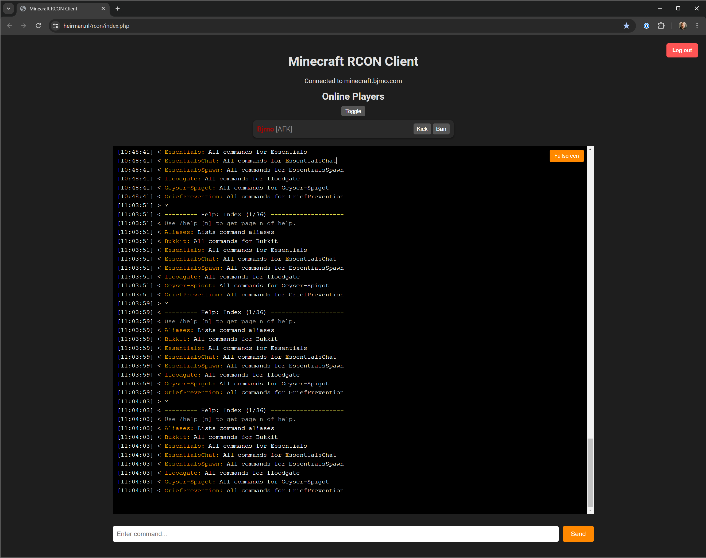
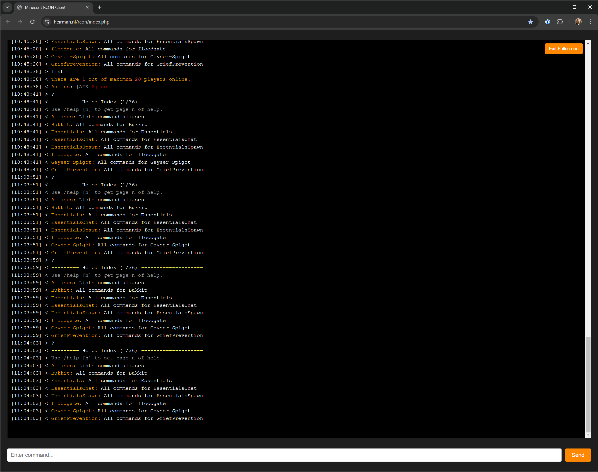

# Minecraft RCON Client

A simple, web-based Minecraft RCON Client written in PHP. This project allows you to connect to your Minecraft server via RCON, execute commands, view real-time console output, and manage online players—all from your browser. The interface also supports a mobile web app mode with an integrated "Add to Home Screen" prompt for iOS users.

## Features

- **RCON Command Execution:**  
  Connect to your Minecraft server using RCON credentials and execute commands directly from your web browser.

- **Real-time Console Output:**  
  View the server console output with timestamps in real time.

- **Online Players List:**  
  See a list of online players and manage them (e.g., kick or ban) via intuitive controls.

- **Full Screen Mode:**  
  Toggle a full screen view for the console for an immersive experience.

- **iOS Web App Support:**  
  iOS users receive a one-time "Add to Home Screen" suggestion (displayed 5 seconds after login) that explains how to add the site to the home screen for an app-like experience.

- **Session-Based Login:**  
  Secure login functionality using cookies for persistent sessions.
